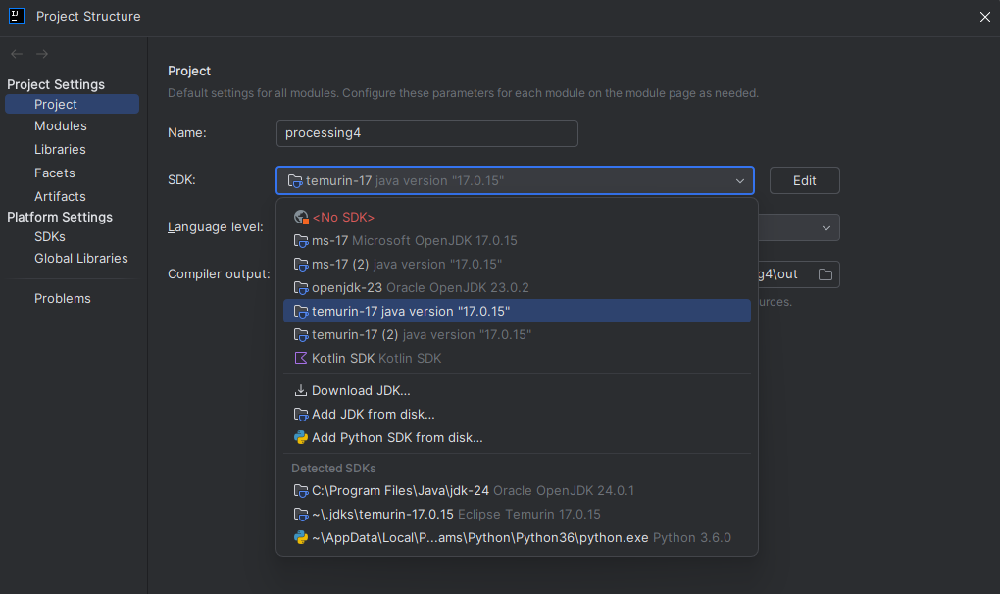
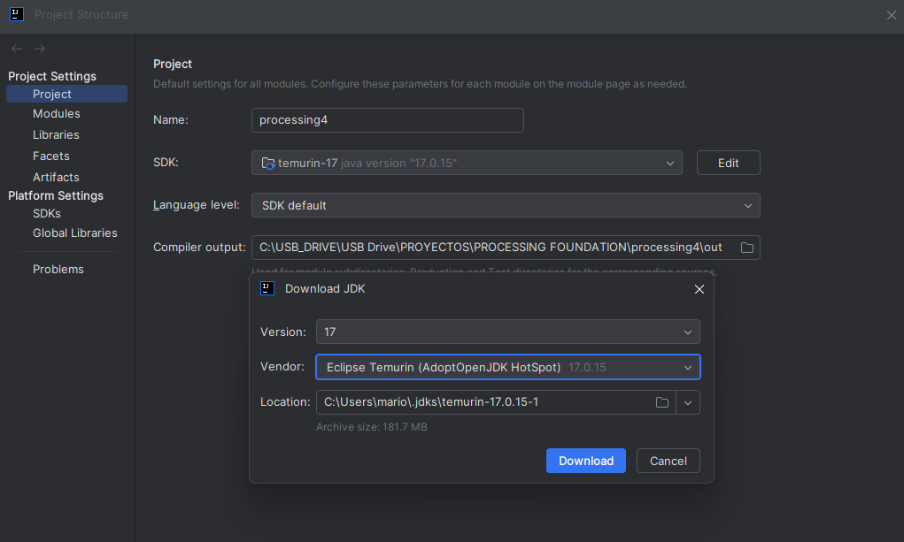

# How to Build Processing

Great to see you are interested in contributing to Processing. To get started you will need to have an IDE to build and develop Processing. Our recommendation and what we use ourselves is Intellij IDEA.

## IntelliJ IDEA (recommended)

First, [download the IntelliJ IDEA Community Edition](https://www.jetbrains.com/idea/download/). Make sure to select the "Community Edition", not "Ultimate". The Community Edition is free and built on open-source software. You may need to scroll down to find the download link. 

> [!TIP]
> If you encounter any issues with this process, Read the [Troubleshooting and Setup Tips for IntelliJ IDEA](#troubleshooting-and-setup-tips-intellij-idea)

1. Clone the Processing4 repository to your machine locally
1. Open the cloned repository in IntelliJ IDEA CE
1. When prompted, select **Trust Project**. You can preview the project in Safe Mode but you won't be able to build Processing.
1. IntelliJ may ask if you want to load Gradle project. If you allow this, make sure you are using JDK version 25.
1. In the main menu, go to File > Project Structure > Project Settings > Project.
1. In the SDK Dropdown option, select a JDK version 25 or Download the jdk
1. Click the green Run Icon in the top right of the window. This is also where you can find the option to debug Processing. 
1. Logs can be found in the `Build` or `Debug` pane on the bottom left of the window


## VSCode
1. Clone the Processing4 repository to your machine locally
1. Open the cloned repository in VScode
1. Wait for Gradle to set up the repository
1. (If you want debugging install [Debugger for Java](https://marketplace.visualstudio.com/items?itemName=vscjava.vscode-java-debug) and [Java Extension Pack](https://marketplace.visualstudio.com/items?itemName=vscjava.vscode-java-pack)) 
1. Go to the Gradle Tab and click app -> Tasks -> compose desktop -> run

Instructions for other editors are welcome and feel free to contribute the documentation for those [here](#other-editors)

## Other Editors

TBD

## Command Line

If you prefer not to use an IDE, you can also build Processing directly from the command line. 

### Set Up the Environment

If you don't have them installed, you will need to install [Git](https://git-scm.com/downloads) and [Gradle](https://gradle.org/install/) first. Then follow these steps:

1. **Clone the repository:**
    ```bash
    git clone https://github.com/processing/processing4.git
    cd processing4
    ```

2. **Install Temurin JDK 25:**
   
Processing requires the Temurin distribution of OpenJDK. 

You can download it from [Adoptium](https://adoptium.net/), from [GitHub releases](https://github.com/adoptium/temurin25-binaries/releases),
or find it in the package manager for your platform.

### macOS:
```bash
brew install --cask temurin@25
````

### Windows (using winget):
```bash
winget install --id=EclipseAdoptium.Temurin.25.JDK  -e
```

### SDKMAN!

[SDKMAN!](https://sdkman.io/) is a useful tool for developers working on multiple versions of the JVM.

## Install `jextract`

`jextract` is a tool included in the JDK that generates Java bindings from C header files. 
It is required to build Processing when using WebGPU. You can download it [here](https://jdk.java.net/jextract/)
or install it using SDKMAN!:

```bash
sdk install jextract
````

3. **Set the `JAVA_HOME` environment variable:**

It may be necessary to set the `JAVA_HOME` environment variable to point to your Temurin JDK 25 installation.

    ```bash
    export JAVA_HOME=/path/to/temurin/jdk-25/
    ```

### Build, Run, and Package Processing

#### Build the Project (Required First Step)

This compiles the source code and prepares everything needed to run or test Processing:

```bash
./gradlew build
```

#### Run Tests

Run unit tests and verify your build:

```bash
./gradlew test
```

#### Launch Processing

Start the Processing Development Environment (PDE):

```bash
./gradlew run
```

#### Create a Distributable Package (Optional)

Generate a packaged version of Processing, ready for distribution:

```bash
./gradlew package
```

The packaged files will be available in the `app/build/compose/binaries` directory.

## Architecture
Processing consists of three main components: `Core`, `Java`, and `App`. The `Core` is independent, while `Java` and `App` depend on it. Currently, `Java` and `App` are interdependent, but efforts are underway to decouple them.

- **Core**: The essential code included with your sketches that provides Processing’s basic functions. When you use functions like `ellipse(25,25,50,50)` or `background(255)`, their underlying code is part of `Core`.

- **Java**: The part of Processing that compiles and runs `.pde` files. It supports different *modes* which implement support for different languages or versions of Processing. The default mode is `Java`.

- **App**: This is the Processing Development Environment (PDE), the visual part of the editor that you see and work within when you use Processing.


### Examples

- You want to fix a bug with one of the argument of a function that you use in a sketch. The `Core` is probably where you would find the implementation of the function that you would like to modify.
- A bug of the PDE editor has been keeping you up at night, you would likely find the relevant code in the `App` section of this project.
- If you've written a large sketch and Processing has become slow to compile and run it, a place to improve this code can most likely be found in the `Java` section.

## User interface
Historically, Processing's UI has been written in Java Swing and Flatlaf (and some html & css). Since 2025 we have switched to include Jetpack Compose. It is backwards-compatible with Swing, which allows us to gradually replace Java Swing components with Jetpack Compose ones, instead of doing a complete overhaul of the editor.

## Build system

We use `Gradle` as the build system for Processing. Until 2025, Processing used `Ant` but we have switched to `Gradle` to be more in line with modern standards. We plan to migrate the internal build system of the `Java` mode to `Gradle` as well, unifying both systems for simplicity.

## Kotlin vs Java
With the introduction of the Gradle build system we now support Kotlin within the repository. Refactors from Java to Kotlin are not  necessary at this stage, but all new functionality should be written in Kotlin.

Any classes that end up being written in Kotlin have their equivalent Java class under `app/ant/` source directory. 

### Running Processing

The main task to run or debug the PDE is `run`. That means you just need to run `./gradlew run` (Linux) or `./gradlew.bat run` (Windows) to build and run Processing.

If your main concern is with the `Core` you don't need to build and start the whole PDE to test your changes. In IntelliJ IDEA you can select any of the sketches in `core/examples/src/.../` to run by click on the green arrow next to their main functions. This will just compile core and the example sketch. Feel free to create additional examples for your new functionality.

If you are specifically trying to run the `Processing CLI`, you can test commands from `app/test/Processing.app/CLITest`.

## Troubleshooting and Setup Tips (IntelliJ IDEA)

If you’re building Processing using IntelliJ IDEA and something’s not working, here are a few things that might help:

### Use the Correct JDK (temurin-25)

Make sure IntelliJ is using **temurin-25**, not another version.

1. Go to **File > Project Structure > Project**
2. Set the **Project SDK** to:    `temurin-25"`



If it is not already installed, you can download it by:
1. Clicking the SDK input field and then selecting the `Download JDK...` option from the menu
2. Select Version: `25`, Vendor: `Eclipse Temurin (AdoptOpenJDK HotSpot)`




Now go back to your main window and
1. Click the green Run Icon in the top right of the window.

### “Duplicate content roots detected”

You may see this warning in IntelliJ:

> `Duplicate content roots detected: '.../processing4/java/src'`

This happens because multiple modules reference the same source folder. It’s safe to ignore.
